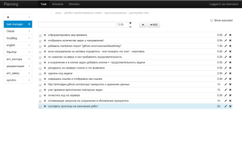

Planning-go — простой планировщик задач (Go + AngularJS)

Описание
- Небольшой учебный проект: веб‑приложение для планирования задач по направлениям.
- Backend на Go хранит данные в JSON‑файле и отдаёт REST‑эндпоинты.
- Frontend на AngularJS (1.x) с Bootstrap отрисовывает список задач, расписание и статистику.

Возможности
- Направления: название, приоритет, рабочие окна времени (WhenWork), дневной лимит (HowLongDay), описание.
- Задачи: длительность, приоритет (сумма приоритета направления и задачи), метка (Label), статус выполнения, учёт отработанного времени.
- Повторяемые задачи: выбор дней недели, авто‑восстановление по расписанию.
- Расписание: генерация слотов по 30 минут для активных направлений с учётом приоритета и рабочих окон; вставка 10‑минутных перерывов; отметка выполненности слотов на лету.
- Статистика: агрегирование времени по направлениям за последние дни.

Технологии и архитектура
- Backend: Go 1.x, стандартная библиотека `net/http`, JSON‑сериализация.
  - Хранение данных: `tasks.json` (автобэкап в `tasks_backup.json` каждые 5 минут).
  - Маршруты:
    - `/` — отдаёт клиент `client/main.html`.
    - `/client/*` — статические файлы фронтенда.
    - `/direction/` — CRUD для направлений (GET/PUT/POST/DELETE).
    - `/task/` — CRUD для задач, поддержка фильтров `executed` и `direction`.
    - `/schedule/` — сгенерированное расписание и отметка выполнения слотов (POST по id).
    - `/statistic/` — статистика по дням.
- Frontend: AngularJS 1.x, Angular Resource, Angular UI, Bootstrap, Chosen, jQuery.
  - Основные экраны: Task (все/по направлению/избранное), Schedule, Direction (список/редактирование).

Быстрый старт
- Требования: установлен Go (https://golang.org/).
- Windows: запустите `run.bat`.
- macOS/Linux: выполните:
  - `go run main.go direction.go schedule.go statistic.go sort_type.go`
- Откройте в браузере: `http://localhost:8080`.

Структура проекта (основное)
- `main.go` — точки входа и HTTP‑маршруты.
- `direction.go` — модели/логика направлений и задач, сохранение/загрузка JSON.
- `schedule.go` — генерация расписания, учёт перерывов и времени.
- `statistic.go` — расчёт статистики по дням.
- `sort_type.go` — сортировка по приоритетам.
- `client/` — frontend (AngularJS, шаблоны, стили, библиотеки).
- `tasks.json` — данные (создаётся автоматически при первом сохранении).

Полезные детали
- Данные сохраняются автоматически при изменениях и периодически бэкапятся.
- Приоритет задачи = приоритет направления + приоритет задачи; задачи с меткой отображаются выше в списках внутри направления.
- Расписание строится только для активных направлений и их рабочих интервалов.

Назначение
- Этот проект подойдёт как база для экспериментов с Go + AngularJS, а также как простой локальный планировщик без базы данных.
